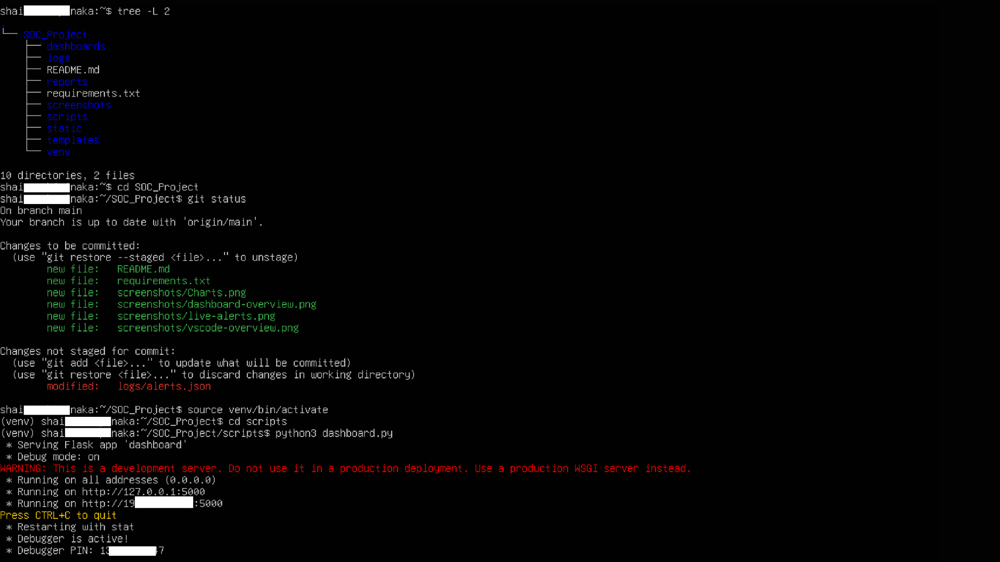
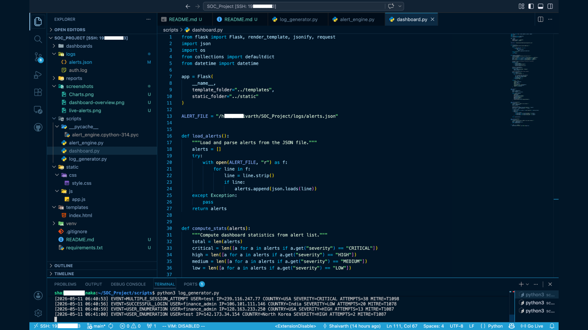
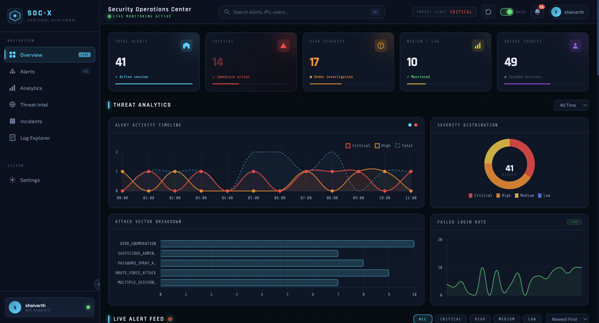
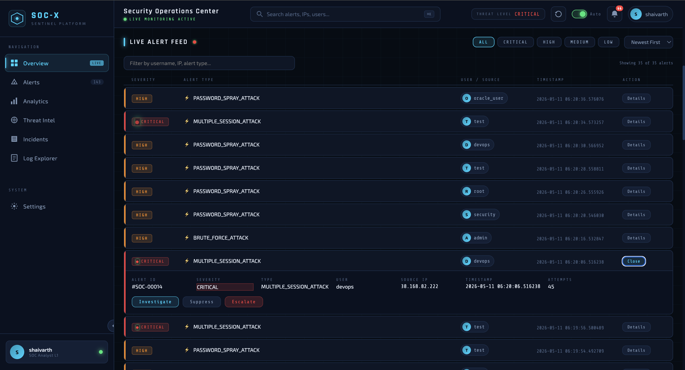
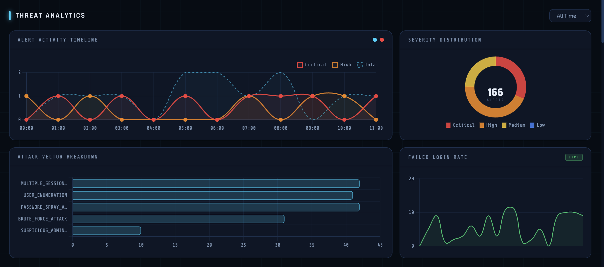

# SOC-X Sentinel

A real-time SOC simulation platform that detects, analyzes, and visualizes cybersecurity threats through a live SIEM-style dashboard.

---

## Overview

SOC-X Sentinel is a cybersecurity-focused Security Operations Center (SOC) simulation platform built to emulate real-world blue-team monitoring workflows.

The project simulates:

* Security telemetry through Python-based log generation
* Attack detection pipelines
* Real-time alert processing
* SIEM-style threat visualization
* Threat severity analysis
* Interactive SOC analyst workflows

SOC-X Sentinel operates as a live detection pipeline with continuously generated telemetry and dynamic threat visualization.

---

# Development Environment

I fully developed SOC-X Sentinel inside a dedicated Linux virtual machine environment to simulate realistic SOC engineering workflows.

## Infrastructure Used

* Ubuntu Linux Virtual Machine
* UTM Virtualization on macOS
* Remote SSH Development Workflow
* VS Code Remote SSH Integration
* Python Virtual Environment (venv)

## Linux Development Workflow
SOC-X Sentinel was developed inside a dedicated Ubuntu virtual machine using a Linux-based security engineering workflow.




The environment was used for:

- Remote SSH development through VS Code
- Git-based version control operations
- Real-time dashboard execution
- Threat telemetry generation
- Detection engine monitoring
- Virtualized SOC lab simulation

The project structure, live services, and monitoring pipelines were managed directly from the Linux terminal environment and sometimes from VScode's multiple terminals.

## VS Code Remote SSH Workflow
I used VS Code Remote SSH to connect to a dedicated Ubuntu virtual machine running on macOS through UTM virtualization, creating an isolated Linux-based cybersecurity engineering environment for developing, testing, and managing SOC-X Sentinel.





## Development Workflow

The project was engineered using a remote development setup:

```text
macOS Host Machine
        ↓
Linux Virtual Machine (Ubuntu)
        ↓
Remote SSH Connection
        ↓
VS Code Remote Development
        ↓
Cybersecurity Engineering Environment
```

This setup allowed:

* Isolated security testing
* Linux-native development
* Realistic SOC engineering workflow
* Remote infrastructure management
* Multi-terminal monitoring pipelines
* Virtualized cybersecurity lab simulation

**The dashboard, detection engine, telemetry generator, and GitHub deployment pipeline were all managed through this remote Linux development environment.**

---

## Dashboard Preview


### Main Dashboard





### Live Alert Feed





### Threat Analytics





---

## Core Features

### Real-Time Telemetry Pipeline

* Continuous security event generation
* Simulated authentication activity
* Dynamic threat traffic simulation
* Real-time log ingestion

### Detection Engineering

SOC-X Sentinel currently detects:

* SSH Brute Force Attacks
* Password Spray Attacks
* User Enumeration Attempts
* Suspicious Admin Logins
* Multiple Session Abuse

### Live SIEM Dashboard

* Real-time alert feed
* Auto-refreshing telemetry
* Severity-based alerts
* Threat analytics charts
* Interactive alert panels
* Analyst workflow controls

### MITRE ATT&CK Mapping

Each generated alert includes:

* MITRE ATT&CK technique mapping
* Severity classification
* Source IP telemetry
* Threat metadata

### SOC Workflow Simulation

* Investigate alerts
* Escalate alerts
* Suppress alerts
* Real-time analyst interaction

---

## Architecture

```text
                                                ┌────────────────────┐
                                                │  log_generator.py  │
                                                └─────────┬──────────┘
                                                          │
                                                          ▼
                                                      auth.log
                                                          │
                                                          ▼
                                                ┌────────────────────┐
                                                │  alert_engine.py   │
                                                └─────────┬──────────┘
                                                          │
                                                          ▼
                                                     alerts.json
                                                          │
                                                          ▼
                                                ┌────────────────────┐
                                                │    dashboard.py    │
                                                └─────────┬──────────┘
                                                          │
                                                          ▼
                                               Real-Time SOC Dashboard
```


---

## Tech Stack

## Backend

* Python 3
* Flask
* JSON-based telemetry processing

## Frontend

* HTML5
* CSS3
* JavaScript
* Chart.js

## Cybersecurity Concepts

* SIEM workflows
* Detection engineering
* Threat telemetry
* SOC operations
* MITRE ATT&CK mapping
* Log analysis

---

## Project Structure

```text
SOC-X-Sentinel/
│
├── scripts/
│   ├── log_generator.py
│   ├── alert_engine.py
│   └── dashboard.py
│
├── logs/
│   ├── auth.log
│   └── alerts.json
│
├── templates/
│   └── index.html
│
├── static/
│   ├── css/
│   │   └── style.css
│   └── js/
│       └── app.js
│
├── screenshots/
│
├── requirements.txt
├── README.md
└── .gitignore
```

---

# Installation

## Clone Repository

```bash
git clone https://github.com/Shaivarth/SOC-X-Sentinel.git

cd SOC-X-Sentinel
```

---

## Install Dependencies

```bash
pip install -r requirements.txt
```

---

## Running the Project

### Terminal 1 — Start Telemetry Generator

```bash
cd scripts
python3 log_generator.py
```

### Terminal 2 — Start Detection Engine

```bash
cd scripts
python3 alert_engine.py
```

### Terminal 3 — Start Dashboard

```bash
cd scripts
python3 dashboard.py
```

---

## Open Dashboard

```text
http://127.0.0.1:5000
```

---

## Detection Workflow

```text
Telemetry Generation
        ↓
Authentication Logs
        ↓
Threat Detection Engine
        ↓
Alert Processing
        ↓
JSON Alert Storage
        ↓
Live SOC Visualization
```

---

## Current Capabilities

| Capability                  | Status      |
| --------------------------- | ----------- |
| Real-Time Alert Feed        | Implemented |
| Severity-Based Detection    | Implemented |
| SIEM-Style Dashboard        | Implemented |
| Interactive Alert Panels    | Implemented |
| Live Chart Updates          | Implemented |
| MITRE ATT&CK Mapping        | Implemented |
| Geolocation Metadata        | Implemented |
| Incremental Alert Streaming | Implemented |

---

## Planned Improvements

Future roadmap:

* WebSocket-based live streaming
* Docker deployment
* Persistent database storage
* User authentication
* Analyst notes system
* Threat intelligence feeds
* Sigma rule integration
* Elastic/Splunk integration
* Threat map visualization
* Report export system

---

## Why This Project Matters

I designed 'SOC-X Sentinel' to move beyond beginner cybersecurity projects and simulate actual SOC engineering concepts.

This project focuses on:

* Detection engineering
* Security telemetry pipelines
* Real-time monitoring
* SIEM-style workflows
* SOC analyst interaction

The goal was to build a system that resembles operational blue-team infrastructure rather than isolated security scripts.

---

## Author

Sarthak Mishra

Cybersecurity | SOC Engineering | Detection Engineering | Blue Teaming

---

## License

This project is licensed under the MIT License.
